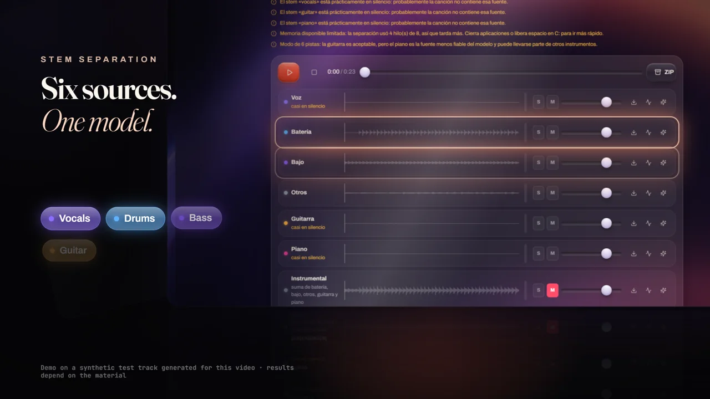
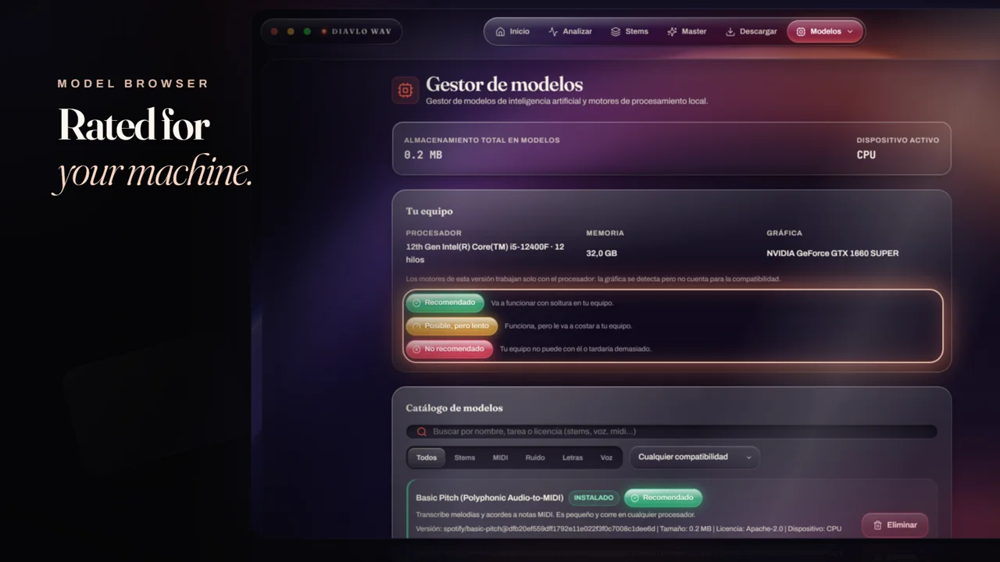

 

**Software · Audio · AI · Creative Technology**

I build software that listens.

 

[**DIAVLOWAV**](https://github.com/Nikolai-coder/diavlo-wav-releases)　·　[**Download**](https://github.com/Nikolai-coder/diavlo-wav-releases/releases/latest)　·　[**Watch the film**](https://github.com/Nikolai-coder/diavlo-wav-releases/blob/main/media/diavlowav-hero.mp4)

 

## DIAVLOWAV

*A local audio workstation for Windows.* 
*Measure it. Separate it. Master it. Nothing leaves your machine unless you say so.*

 

Recorded from the real application on a synthetic test track. Click for the 26-second film.

 

<table>
  <tr>
    <td width="50%" valign="top">
      
       <b>Stem separation</b> 
      Hybrid Transformer Demucs running locally. Vocals, drums, bass and other, plus a derived instrumental. A six-source mode with guitar and piano arrives in v1.3.1.
    </td>
    <td width="50%" valign="top">
      
       <b>Mastering</b> 
      EBU R128 measurement before and after, an adaptive plan, and a true-peak check on the file that was actually written.
    </td>
  </tr>
  <tr>
    <td width="50%" valign="top">
      
       <b>Model browser</b> 
      Every model is rated against your CPU, memory and disk with a green, amber or red crystal badge, so you know before you download.
    </td>
    <td width="50%" valign="top">
      
       <b>Audio to MIDI</b> 
      Polyphonic transcription with Basic Pitch, previewed as a note roll before you export.
    </td>
  </tr>
</table>

 

## Currently building

| Area | Where it stands |
| :-- | :-- |
| **Desktop app** | Shipping. Windows 10 and 11, x64, signed in-app updates. |
| **Stem separation** | Four stems shipping. Six stems (guitar and piano) are in final testing for v1.3.1. |
| **Mastering** | Shipping. Loudness is measured, not estimated. |
| **Model management** | Shipping. Verified downloads, hardware ratings, real status. |
| **AI audio** | Audio to MIDI ships. Optional cloud providers stay off unless you turn them on. |
| **Android** | In development. A debug build exists; it is not released. |
| **iOS** | Planned. |

 

## Stack

`Rust` · `Tauri 2` · `React 19` · `TypeScript` · `FFmpeg` · `Demucs` · `Basic Pitch` · `GitHub Actions`

 

Nikolai Coder · Creator of DIAVLOWAV

